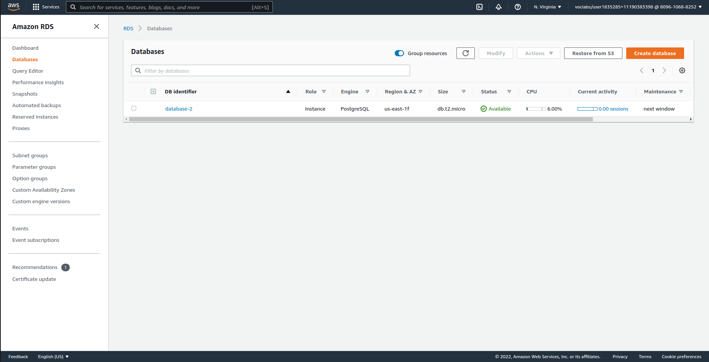
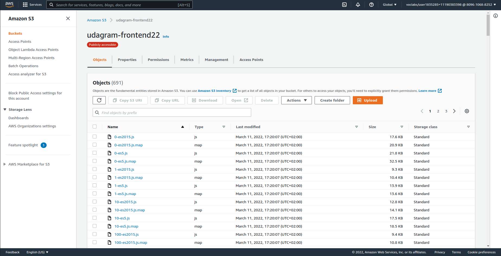

# Pipeline 

## How it works!

- First the developer make changes in code.
- Push The changes to Github repo branch master.
- Automaticlly the circleci build and deploy the changes to aws.

## How to deploy manualy
1. create aws account with cli & console permission [How](https://docs.aws.amazon.com/IAM/latest/UserGuide/id_users_create.html)
>
2. create database -- postgres -- [How to create Database](https://aws.amazon.com/getting-started/hands-on/create-connect-postgresql-db/)

3. create Node.js EB instance [How](https://docs.aws.amazon.com/elasticbeanstalk/latest/dg/eb3-create.html)

4. create s3 bucket [How](https://docs.aws.amazon.com/AmazonS3/latest/userguide/create-bucket-overview.html)

5. open Terminal:
>Don't forget to install aws eb cli [here](https://docs.aws.amazon.com/elasticbeanstalk/latest/dg/eb-cli3-install.html)
 - aws configure ***enter your credintials>***
 - run the code udagram/udagram-api 
 >npm run deploy
 
***Don't forget to change the setenv variables with yours.***
 - run the code udagram/udagram-front 
 >npm run deploy
***Don't forget to change the bucket name with yours. aws s3 cp --recursive --acl public-read ./www s3://bucket-name/***

